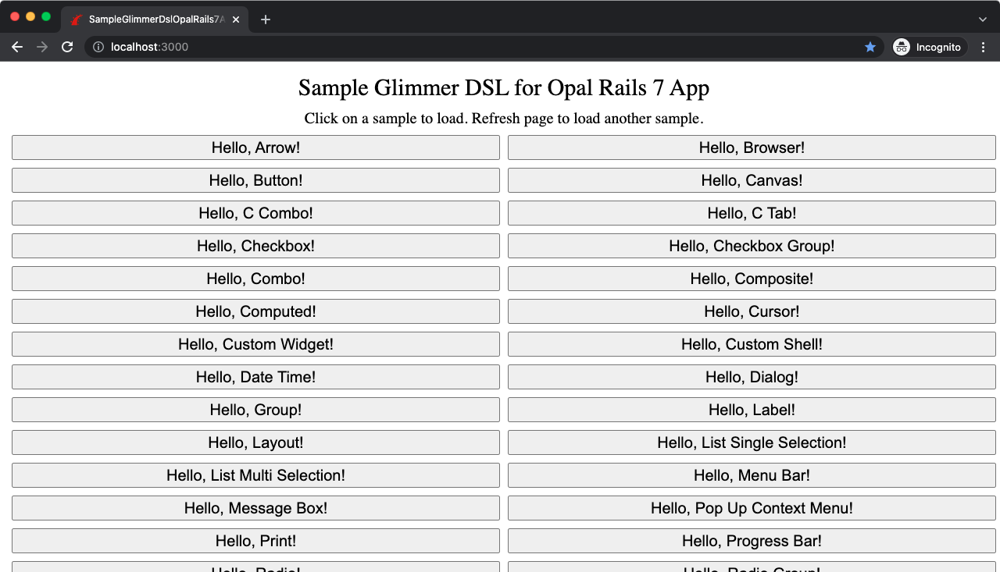

# Sample Glimmer DSL for Opal Rails 7 App
## [ Glimmer Application](https://github.com/AndyObtiva/glimmer-dsl-opal)

This is a sample app built with [Glimmer DSL for Opal](https://github.com/AndyObtiva/glimmer-dsl-opal), an experimental proof-of-concept web GUI adaptor for [Glimmer](https://github.com/AndyObtiva/glimmer) desktop app samples (i.e. samples found in [Glimmer DSL for SWT](https://github.com/AndyObtiva/glimmer-dsl-swt)). It webifies them via [Rails](https://rubyonrails.org/) and [Opal](https://opalrb.com/), allowing [Glimmer](https://github.com/AndyObtiva/glimmer) desktop app samples to run on the web without changing a line of code.

## Setup Instructions

This is a standard Rails app. As such, you may setup locally by cloning the repository and running the following commands from inside the app directory:
- `bundle`
- `rails db:migrate`
- `rails s`

You should see all samples listed by default.

## Hosted Website

You may check out a hosted website on Heroku at:

https://sample-glimmer-dsl-opal-rails7.herokuapp.com/

## License

[MIT](https://opensource.org/licenses/MIT)

Copyright (c) 2022 Andy Maleh. See [LICENSE.txt](LICENSE.txt) for further details.

--

 Built with [Glimmer](https://github.com/AndyObtiva/glimmer) (Ruby Desktop Development GUI Library)
